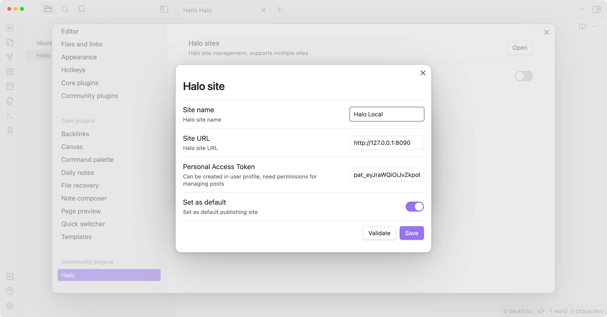
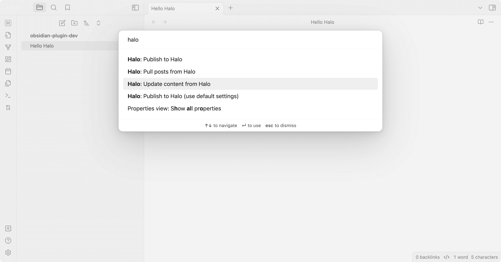

# Obsidian plugin for Halo

This plugin allows you to publish your Obsidian documents to [Halo](https://github.com/halo-dev/halo).

[中文文档](./README.zh-CN.md)

## Preview





## Usage

1. Search for "Halo" in Obsidian's community plugins browser.
2. Click **Install**.
3. Go to **Settings** -> **Community Plugins** -> **Halo** and configure the settings.
4. Create a new site:
   1. Site name: the name of the site, optional.
   2. Site URL: the URL of the site, e.g. `https://example.com`.
   3. Personal access token:
      The personal access token of your Halo site, needs `Post Manage` permission.

       

       More information about personal access token: [Personal Access Token](https://docs.halo.run/user-guide/user-center#%E4%B8%AA%E4%BA%BA%E4%BB%A4%E7%89%8C)

   4. Set as default: set the site as the default site.
5. Open a note you want to publish, and run the command `Halo: Publish to Halo`.
6. All available commands:
   - **Halo: Publish to Halo**: publish the current note to Halo.
   - **Halo: Publish to Halo (use default settings)**: publish the current note to the default site.
   - **Halo: Pull posts from Halo**: pull posts from Halo to Obsidian.
   - **Halo: Update content from Halo**: update the content of the current note from Halo.

## Development

1. [Create a new Obisidian vault](https://help.obsidian.md/Getting+started/Create+a+vault) for development.
2. Clone this repo to the **plugins folder** of the newly created vault.

   ```bash
   cd path/to/vault/.obsidian/plugins

   git clone https://github.com/ruibaby/obsidian-halo
   ```

3. Install dependencies

   ```bash
   cd obsidian-halo

   npm install
   ```

4. Build the plugin

   ```bash
   npm run dev
   ```

5. Reload Obsidian and enable the plugin in Settings.

## Credits

- [obsidian-wordpress](https://github.com/devbean/obsidian-wordpress): the original idea came from this repo.

## TODO

- [x] i18n
- [ ] Upload images
- [x] Publish this plugin to Obsidian community
