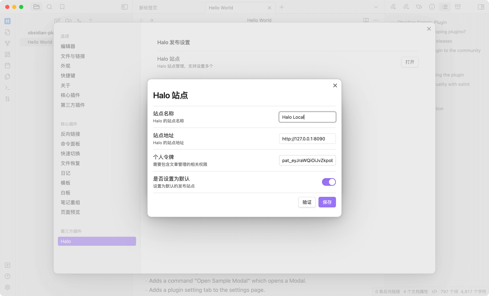
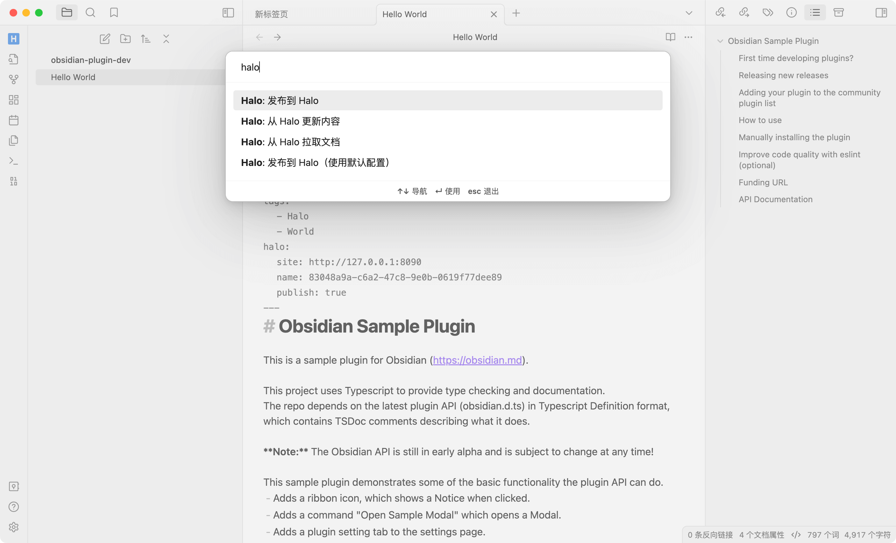

# Obsidian Halo 插件

这个插件可以让你将 Obsidian 文档发布到 [Halo](https://github.com/halo-dev/halo)。

[English](./README.md)

## 安装

1. 在 Obsidian 的社区插件市场中搜索 **Halo**。
2. 点击 **安装**。

## TODO

- [x] 国际化
- [ ] 上传图片
- [x] 发布此插件到 Obsidian 社区

## 预览




## 开发

1. [创建一个新的 Obsidian 仓库](https://help.obsidian.md/Getting+started/Create+a+vault)用于开发。
2. 将此仓库克隆到新创建的文库的 **plugins 文件夹** 中。

   ```bash
   cd path/to/vault/.obsidian/plugins

   git clone <https://github.com/ruibaby/obsidian-halo>
   ```

3. 安装依赖

   ```bash
   cd obsidian-halo

   npm install
   ```

4. 构建插件

   ```bash
   npm run dev
   ```

5. 重新加载 Obsidian 并在设置中启用插件。

## 致谢

- [obsidian-wordpress](https://github.com/devbean/obsidian-wordpress): 最初的想法来源于这个仓库。
