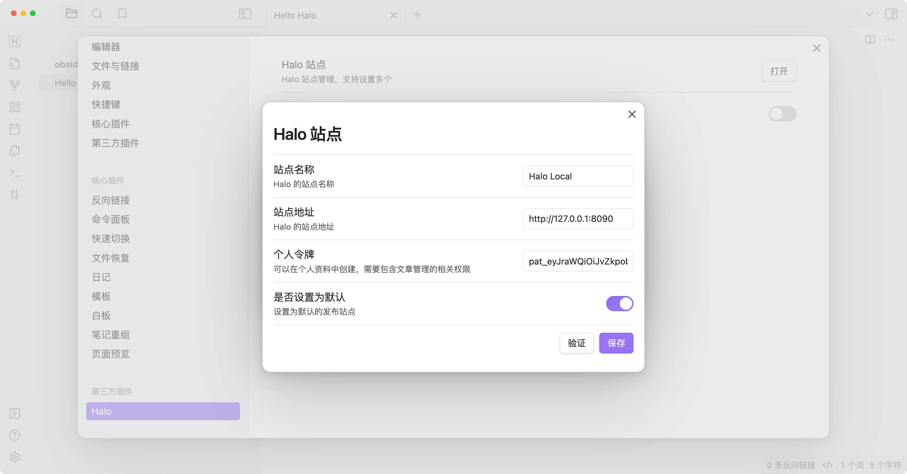
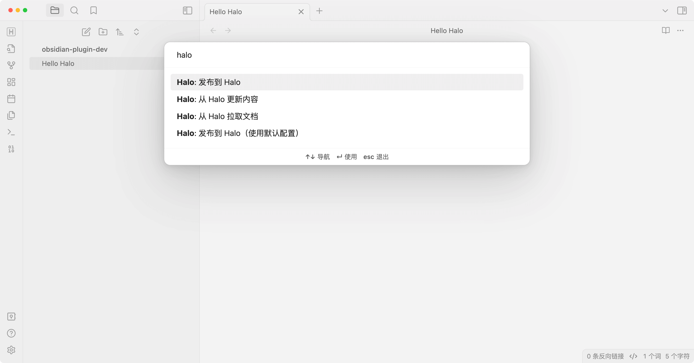

# Obsidian Halo 插件

这个插件可以让你将 Obsidian 文档发布到 [Halo](https://github.com/halo-dev/halo)。

[English](./README.md)

## 预览





## 使用

1. 在 Obsidian 的社区插件市场中搜索 **Halo**。
2. 点击 **安装**。
3. 进入设置 -> 社区插件 -> Halo。
4. 创建一个新站点：
   1. 站点名称：站点的名称，可选。
   2. 站点 URL：站点的 URL，例如 `https://example.com`。
   3. 个人访问令牌：
      你的 Halo 站点的个人访问令牌，需要具有 `文章管理` 权限。

      

      有关个人访问令牌的更多信息，请参阅：[个人令牌](https://docs.halo.run/user-guide/user-center#%E4%B8%AA%E4%BA%BA%E4%BB%A4%E7%89%8C)
   4. 设置为默认：将该站点设置为默认站点。

5. 打开要发布的笔记，并运行命令。
6. 所有可用的命令：
   - **Halo: 发布到 Halo**：将当前笔记发布到 Halo。
   - **Halo: 发布到 Halo（使用默认配置）**：将当前文档发布到默认站点。
   - **Halo: 从 Halo 拉取文档**：从 Halo 拉取文章到 Obsidian。
   - **Halo: 从 Halo 更新内容**：从 Halo 更新当前文档的内容。

## 开发

1. [创建一个新的 Obsidian 仓库](https://help.obsidian.md/Getting+started/Create+a+vault)用于开发。
2. 将此仓库克隆到新创建的文库的 **plugins 文件夹** 中。

   ```bash
   cd path/to/vault/.obsidian/plugins

   git clone <https://github.com/ruibaby/obsidian-halo>
   ```

3. 安装依赖

   ```bash
   cd obsidian-halo

   npm install
   ```

4. 构建插件

   ```bash
   npm run dev
   ```

5. 重新加载 Obsidian 并在设置中启用插件。

## 致谢

- [obsidian-wordpress](https://github.com/devbean/obsidian-wordpress): 最初的想法来源于这个仓库。

## TODO

- [x] 国际化
- [ ] 上传图片
- [x] 发布此插件到 Obsidian 社区
